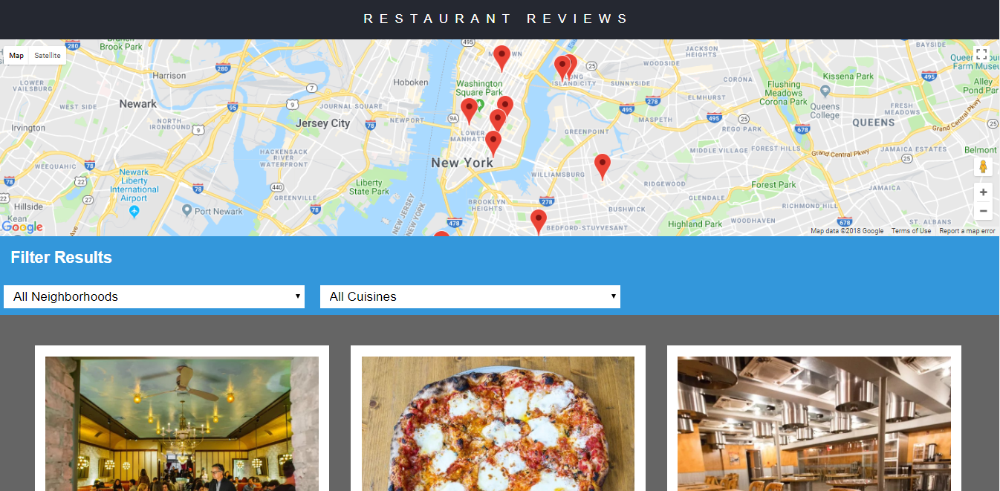

# Project Overview (Restaurant Review)

In this Restaurant Review project, students are given a static webpage to be converted to all media-friendly web application.The original application lacks modern web features such as accessibility,responsiveness and able to load offline. Therefore the purpose of the project is to make the project responsive, and also to comply with accessibility requirement. The application should also use the capabilities of service worker to load the page during offline.
 

# How to run this project?

<li>1. You could simply clone or download this repository at [this link](https://github.com/dagbanbia/myRestaurant.git).</li>
<li>2. Navigate your terminal into the myRestaurant directory.</li>
<li>3.Before continuing , make sure to have install python on your machine.</li>
<li>4. write the following command at your terminal. python -m SimpleHTTPServer 7777</li>
<li>5. if port 7777 is already in use, then choose another port but change 7777 in dbhelper.js to that port number.</li>
<li>6. If the local server is running, then go to the site of your favorate brower at http://localhost.7777.</li>

I hope you find your favorite restaurant 🍴

## Required Dependencies

Ideally any modern browsers should be enough to open and locate your favorate restaurant.

## References:

<li>Udacity Course material</li>
<li>Youtube</li>
<li>Google Searches</li>